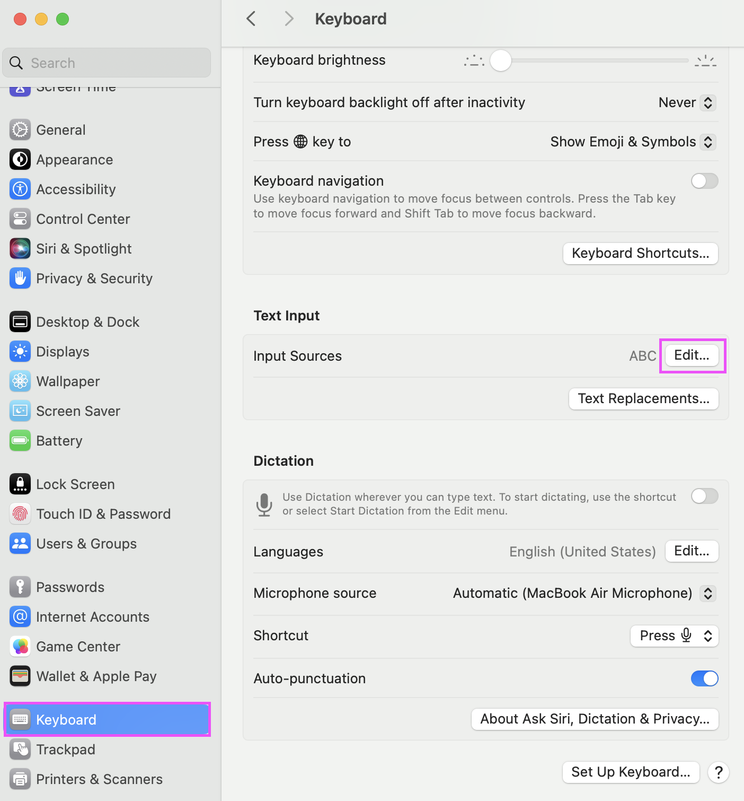
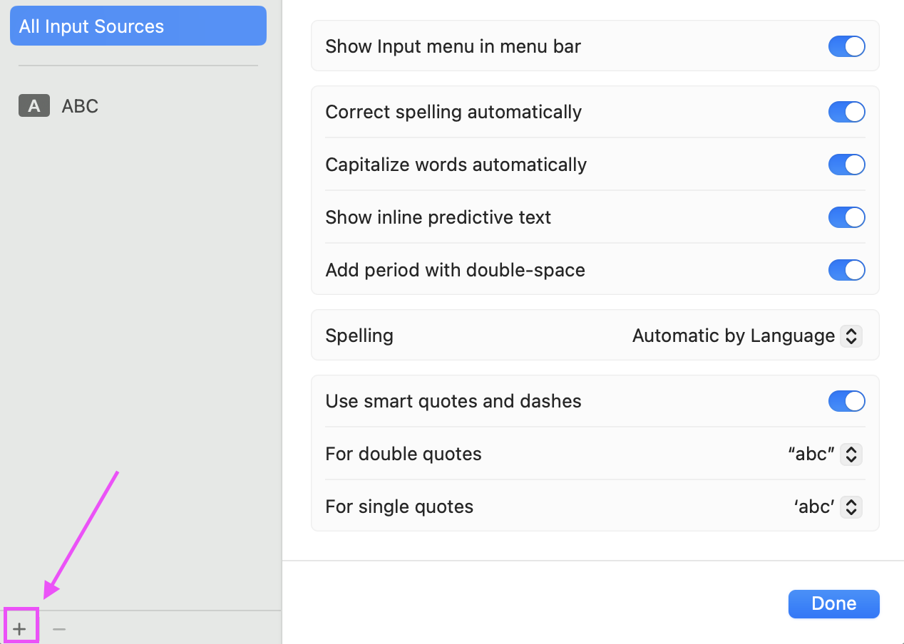
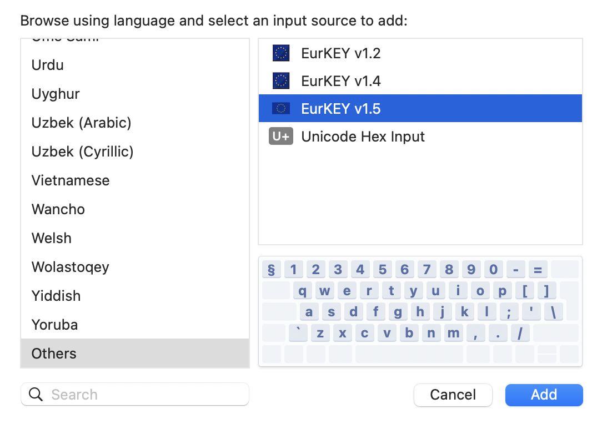
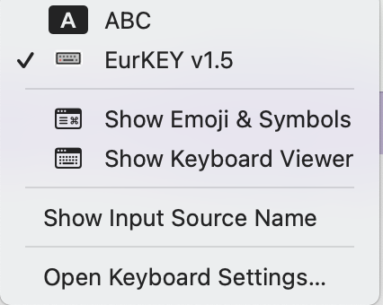

# EurKEY-macOS

The Keyboard Layout for Europeans, Coders and Translators. This repo is a fork and contains a **modified verison** of the EurKEY base layout. It builds on the official layout. You can find version 1.3, the latest official release, in the bundle as well. See the changelog below for my modifications.

EurKEY-macOS is a rework targeted at MacBooks with the with pyhiscal English International keyboard (ISO) instead of the ANSI layout from the official upstream. Since it is an ISO layout, it has one additional key (`) and the big Enter key.

The keyboard layout should be compatible with the other ISO layouts typically available in Europe (e.g. German ISO). However, the printed keys will obviously be different. I tested the layout on the current tenkeyless MacBook keyboard (MacBook Air 2024). Working numpad keys are therefore not guaranteed.

## Installation

- Download the `EurKEY.bundle` file.
- Copy the `EurKEY.bundle` file to `/Library/Keyboard Layouts/` (for global installation) or `~/Library/Keyboard Layouts/` (for user installation).
- Open System Settings > Keyboard > Input Sources <br>
- Click the `+` button <br>
- Add `EurKEY` from the list of available input sources <br>
- Select `EurKEY` as the input method <br>

## Notes on Ukelele and template icons

I have tried to configure a template icon for the bundle and stumbled onto behaviour that I consider a bug in Ukelele. Template icons are the new style of icons that switch color depending on the system theme.

I tried simply setting a template icon from the GUI using the checkbox, but it never saved it correctly. I had to manually edit `*.bundle/Info.plist` file and set the flag.

The structure of the Info.plist file is as follows:

```xml
<?xml version="1.0" encoding="UTF-8"?>
<!DOCTYPE plist PUBLIC "-//Apple//DTD PLIST 1.0//EN" "http://www.apple.com/DTDs/PropertyList-1.0.dtd">
<plist version="1.0">
<dict>
	<key>CFBundleIdentifier</key>
	<string>de.felixfoertsch.keyboardlayout.EurKEY-macOS</string>
	→ Bundle Identifier

	<key>CFBundleName</key>
	<string>EurKEY-macOS</string>
	→ Filename of the *.bundle file

	<key>CFBundleVersion</key>
	<string></string>
	<key>KLInfo_EurKEY v2.0</key>
	→ Name of the keyboard layout in the collection list

	<dict>
		<key>TICapsLockLanguageSwitchCapable</key>
		<false/>
		<key>TISIconIsTemplate</key>
		<true/>
		→ Set to true to use the icon as a template

		<key>TISInputSourceID</key>
		<string>de.felixfoertsch.keyboardlayout.EurKEY-macOS.eurkeyv2.0</string>
		→ Identifier for the layout within the bundle, spaces are simply removed from the name.
		→ The syntax is: reverse-prefix-notation.BundleIdentifier.LayoutName

		<key>TISIntendedLanguage</key>
		<string>en</string>
	</dict>
</dict>
</plist>
```

## Changelog

### v2.0 (WIP)

- Configures every key exactly as it is printed on the MacBook keyboard (ISO, English - International).
- Removes distiction between left/right modifier keys.
- Uses the `*.bundle` format to group the layout versions.
- Adds new monochrome macOS template icon that switches color with the system theme.
- Renames all dead key states to their initializing key combination for easier identifcation. The following table shows the mappings:
	| Key Combinations | Dead Key Symbol |
	| ---------------- | --------------- |
	| ⌥`|`               |
	| ⌥⇧`             | ~               |
	| ⌥'               | ´               |
	| ⌥⇧'             | ¨               |
	| ⌥6               | ^               |
	| ⌥⇧6             | ˇ               |
	| ⌥7               | ˚               |
	| ⌥⇧7             | ¯               |
	| ⌥m               | Ω               |
	| ⌥⇧m             | √               |
	| ⌥\               | ¬               |

### v1.4

- Switches behaviour of superscript and subscript numbers: The subscript numbers are the default; the superscript numbers are available via `⌥⇧<number>`.

### v1.3

- Implements the layout according to [spec](https://eurkey.steffen.bruentjen.eu/changelog.html). The layout is based on [Leonardo Schenkel's version 1.2](https://github.com/lbschenkel/EurKEY-Mac).

## Attribution

You can find the original EurKEY layout on [Steffen Brüntjens Website](https://eurkey.steffen.bruentjen.eu/start.html). My modified versions are originally based on the work of [Leonardo Brondani Schenkel](https://github.com/lbschenkel/EurKEY-Mac).

## License

- The EurKEY Layout is licensed under [GPLv3](http://www.gnu.org/licenses/gpl-3.0.html). See: [https://eurkey.steffen.bruentjen.eu/license.html](https://eurkey.steffen.bruentjen.eu/license.html).
- The EU flag icon is taken from [Iconspedia](http://www.iconspedia.com/pack/european-flags-1631/), created by [Alpak](http://alpak.deviantart.com/) and licensed under [CC](http://creativecommons.org/licenses/by-nc-nd/3.0).
